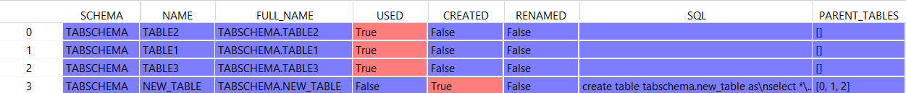
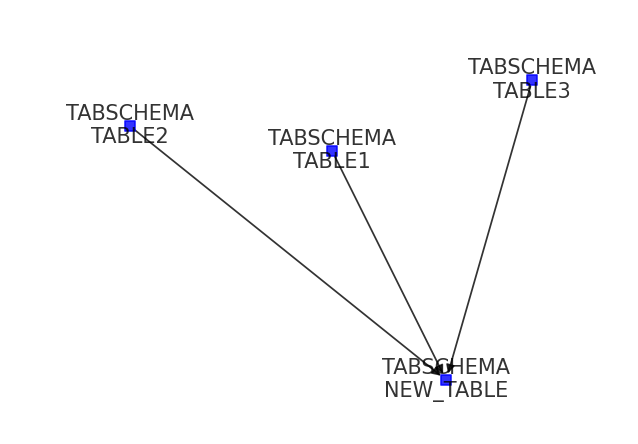

# Table Extractor
This is a small Python package helping to validate, if the prerequisites of a provided data pipeline SQL statement are ready
and the statement should be executed. The first step of the validation is to identify tables used in the SQL statement
(as a side effect this table parser can be used separately for other purposes), and then the identified tables are validated against
a table catalog and the actual table content in the database.

## Installation
As this package is not stored in any package repository, it needs to be installed form GitHub directly. 
There are two options how to do that:

**1. Clone / download this repository to your local hardrive and run from the repository root folder:**
```
pip install .
```
or **2. install with pip from GitHub directly:**
```
pip install git+https://github.kyndryl.net/etl-chapter/table_extractor.git
```


## Usage
There are two classes in the package: TableExtractor and SqlValidator.

### Usage - TableExtractor class
This class can analyze a SQL statement (consisting of a single or of multiple queries), identify all the referenced tables
and assign them the following flags:
- USED - the table is referenced in any FROM or JOIN clause
- CREATED - the table is created with the CREATE (HADDOP) TABLE statement
- RENAMED- the table was renamed from some other name
- POPULATED - the table is populated with the INSERT INTO or LOAD HADOOP INTO TABLE statement

The table list can be exported into a Pandas DataFrame, with some additional fields:
- SQL - the actual query creating the table (or renaming the table to the current name)
- PARENT_TABLES - indexes of all other tables referenced in the above SQL (FROM / JOIN tables, 
or if the table was renamed - then the original table name is referenced) 

The table relationship can be visualized in a simple chart.

#### 1. Load the SQL statement
The package can use SQL statements passed as a string, loaded from a local file or from a GitHub repository:

**To pass a SQL statement as a string:**
``` Python
from table_extractor import TableExtractor

sql = """create table tabschema.new_table as
select *
from tabschema.table1 t1
join tabschema.table2 t2 on t1.c1 = t2.c1
join tabschema.table3 t2 on t2.c1 = t3.c1
;"""

te = TableExtractor(sql)
```

**To load SQL statement from a local file:**
``` Python
from table_extractor import TableExtractor

te = TableExtractor()
te.from_file('query.sql')
```

**To load SQL statement from a file stored on GitHub:**
``` Python
from table_extractor import TableExtractor

# GitHub login name
user_name = "github-user"
# GitHub personnal access token
access_token = "ABCDEFGHIJKLMN"
# file URL (both standard WEB link and the RAW link are accepted)
url = "https://raw.github.kyndryl.net/etl-chapter/table_extractor/master/tests/resources/sysdummy1.sql"

te = TableExtractor()
te.from_github(url, user_name, access_token)
```

#### 2. Analyze the SQL statement
Once the SQL statement is loaded, it can be analyzed and the results exported in a DataFrame format
or visualized in a chart:
```Python
# run SQL analyzes
te.analyze()

# to generate a pandas DataFrame with the tables
df = te.tables_to_data_frame()

# to show a table relationship chart
te.tables_relationship_chart()
```
Sample output for the following query:
```sql
create table tabschema.new_table as
select *
from tabschema.table1 t1
join tabschema.table2 t2 on t1.c1 = t2.c1
join tabschema.table3 t2 on t2.c1 = t3.c1
```

DataFrame output:


Relationship chart:


### SqlValidator class
This class is utilizing the TableExtractor to identify tables in a SQL statement and to check them 
against a table catalog:
- if the table is registered in the catalog
- what is the table expected upload date
- which table column holds the upload date

As a second step, the source tables (i.e. tables which are 'used', but not 'created' / 'renamed' / 'populated')
are queried in the database, to check if their content is 'fresh' (i.e. the latest date in the upload column
is not older than the minimal upload date in the table catalog).

There are the same options to provide a SQL statement like for the TableExtractor class - as a string,
as a local file or as a file stored on GitHub.

To be able to connect to the database and to the table catalog, an opened pyodbc connection is required.

**To pass a SQL statement as a string:**
``` Python
import pyodbc
from table_extractor import SqlValidator

# open database connection
db_con = pyodbc.connect("connection string for the database")

sql = """create table tabschema.new_table as
select *
from tabschema.table1 t1
join tabschema.table2 t2 on t1.c1 = t2.c1
join tabschema.table3 t2 on t2.c1 = t3.c1
;"""

table_catalog = "IZ_EAM_VAULT_NC.V_ETL_SCOPE"

sv = SqlValidator(sql=sql, db_con=db_con, table_catalog=table_catalog)

# check validation result
print(sv.table_validations)

# check error_details
for tv in sv.table_validations:
    if not tv.validation_successful:
        print(f"{tv.table.full_name} - {tv.validation_error}")
```

**To load SQL statement from a local file:**
``` Python
sv = SqlValidator(sql=sql, db_con=db_con, file_name="query.sql")
```

**To load SQL statement from a file stored on GitHub:**
``` Python
# GitHub login name
user_name = "github-user"
# GitHub personnal access token
access_token = "ABCDEFGHIJKLMN"
# file URL (both standard WEB link and the RAW link are accepted)
url = "https://raw.github.kyndryl.net/etl-chapter/table_extractor/master/tests/resources/sysdummy1.sql"

sv = SqlValidator(sql=sql, db_con=db_con, url=url, github_username=user_name, github_access_token=access_token)
```

## Development
For the development environment:
- install packages specified in requirements/requirements_dev.txt
- to be able to run all tests locally, create environment variables:
  - GH_USERNAME (your GitHub user name) and GH_TOKEN (your GitHub personal access token)
  - SQL_VALIDATOR_CONNECTION_STRING (access string to the database with table catalog - 'Central')